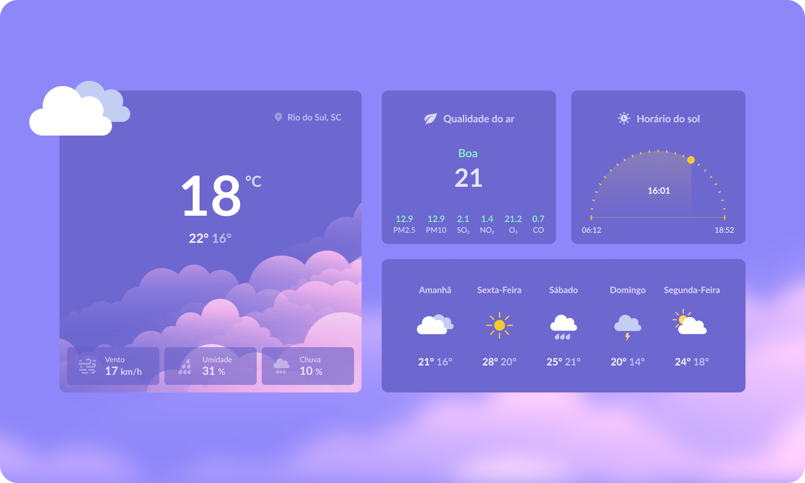

# AivanClimate

O projeto AivanClimate, teve seu início atrás de um evento que ocorre toda semana, o #BoraCodar, fornecido pela Rocketseat.

O projeto AivanClimate, tem como objetivo servir como um relógio/previsão do tempo, assim o cliente pode se informar se hoje as 18:40 estará chovendo ou se o clima está favorável para fazer alguma atividade física ao ar livre.

## Demonstração

## 💻 Tech Stack:
  
  
 

## Material

https://www.figma.com/community/file/1215291914714743267/%23boraCodar---Desafio-10

## Licença

[MIT License](https://choosealicense.com/licenses/mit/)

## Suporte

Para suporte, mande um email para ivan.rocha.0987@gmail.com ou entre em contato via whatsapp (41) 98468-5317.

## Feedback

Se você tiver algum feedback, por favor enviar para ivan.rocha.0987@gmail.com

## Autores

- [@IvanRocha](https://www.github.com/ivanrocha10)
- [@Rocketseat](https://github.com/Rocketseat)

## Projeto

  Acesse o "AivanClimate" pelo QR:

  

Caso o QR não funcione, acesse <a href="https://ivanrocha10.github.io/AivanClimate/">aqui</a>